================================================================================
Working on a machine learning challenge with sklearn
================================================================================

-----

Me
================================================================================

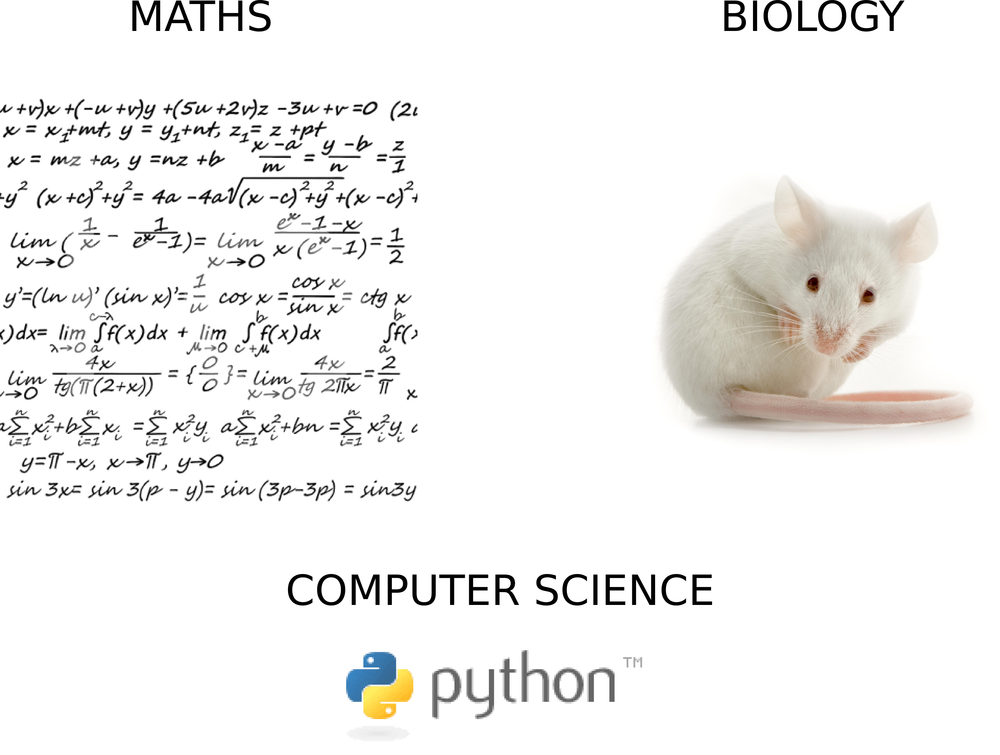

----

What is machine learning?
--------------------------------------------------------------------------------

.. raw:: html

   <blockquote>

"Machine learning is about the **construction** and **study** of systems
that can **learn** from data. The core of machine learning deals with
**representation** and **generalization**."

.. raw:: html

   </blockquote>
    
    
    
    
    
    

.. raw:: html

  

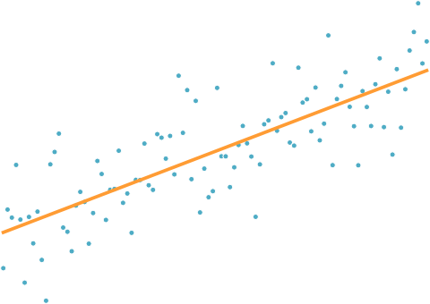

.. raw:: html

  

----

Unsupervised learning
--------------------------------------------------------------------------------

also known as Data Mining
~~~~~~~~~~~~~~~~~~~~~~~~~~~~~~~~~~~~~~~~~~~~~~~~~~~~~~~~~~~~~~~~~~~~~~~~~~~~~~~~

.. raw:: html

   <blockquote>

The key task of unsupervised learning is to discover **unknown knowledge**,
uncover **patterns** and build **models**.

.. raw:: html

   </blockquote>

.. image:: images/clusters.png

-------

Supervised learning
================================================================================

Supervised learning builds (automatically) a function that maps the input to
the desired ouputs.

.. raw:: html

   
   
   
   
   
  

.. image:: images/hyperplane.png
  :scale: 90%

.. raw:: html

  

-----

Applications
================================================================================

- Recognize a spam from a mail
- Infer a prognosis for a patient, based on its genetic profile
- Separate different sources from a signal (sound, brainwaves, ..)
- Facial recognition

.. raw:: html

  

.. image:: images/ica.png
  :scale: 55%

----

In practice...
================================================================================

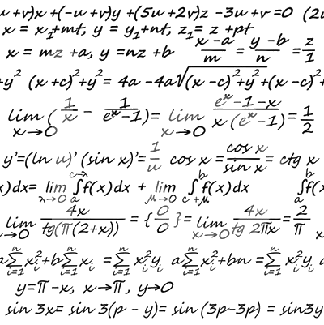

-----

What is a challenge?
================================================================================

.. raw:: html

   <blockquote>

"Companies, governments and researchers present datasets and problems and the
world’s best data scientists compete to produce the best solutions."

.. raw:: html

   </blockquote>
    
    

.. image:: images/dollar.png

----

Why challenges ?
================================================================================

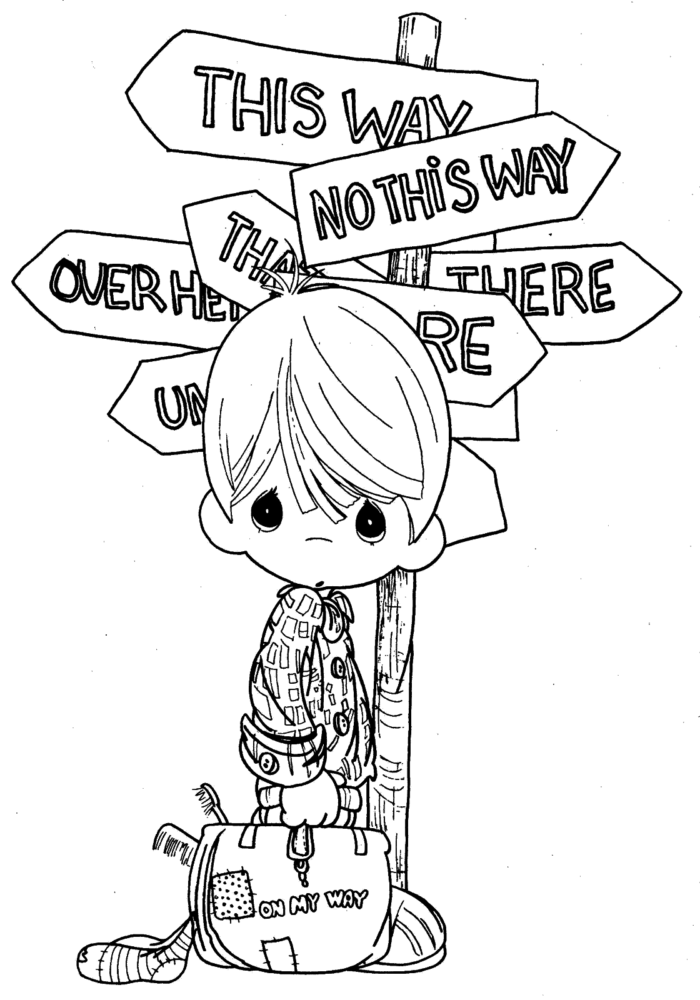

----

How does a challenge work ?
================================================================================

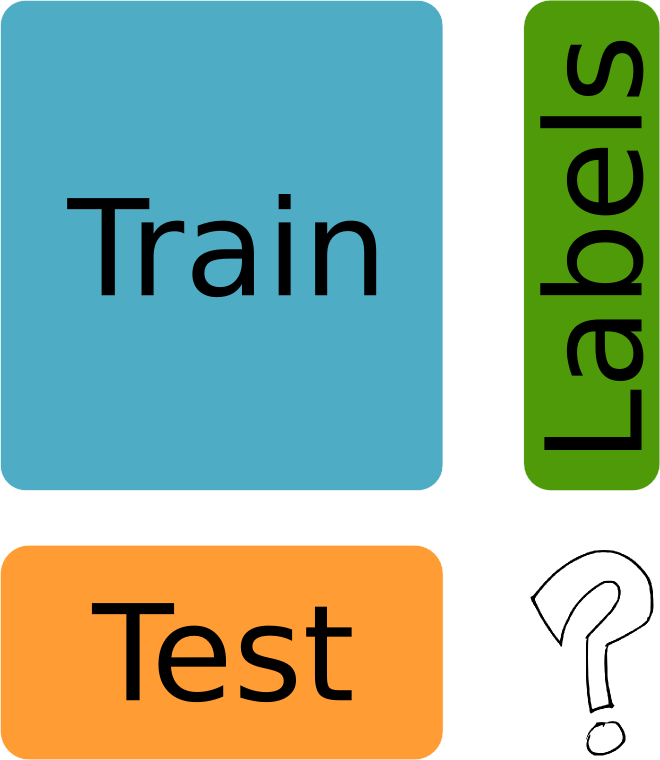

----

A concrete example: Dream 7 - challenge 4
================================================================================

.. raw:: html

   <blockquote>

The challenge is to use genomic information to build models capable of ranking
the sensitivity of cancer cell lines to a set of small molecule compounds or
their combinations.

.. raw:: html

   </blockquote>

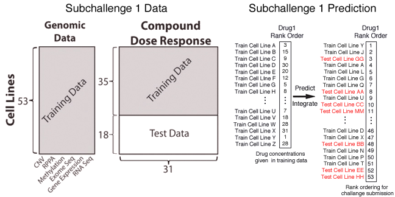

----

Scikit-learn: machine learning without learning the machinery
================================================================================

- **Efficient**

  - good algorithms
  - fast: C, cython, numpy, scipy

- **Pythonic**

  - BSD licenced
  - the only dependencies are numpy + scipy

- **Easy to use**

  - uniform API
  - extensively documented

----

Basics of supervised learning
================================================================================

----

The idea
================================================================================

- **X** is the input data.
- **Y** is the labels, or output data.

We want to learn f such that f(X) = Y and such that a new point will be
predicted correctly.

.. raw:: html

    

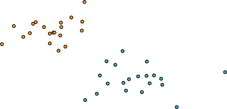

-----

Some of supervised learning algorithms
================================================================================

- k-nearest neighbours
- Least squares and penalized least squares
- Random Forests

----

k-nearest neighbours
================================================================================

**Classification problem:** Make the k-nearest neighbour vote for `X`'s
prediction.

.. raw:: html

    
    

----

k-nearest neighbours (regression)
================================================================================

**Classification problem:** Make the k-nearest neighbour vote for `X`'s
value.

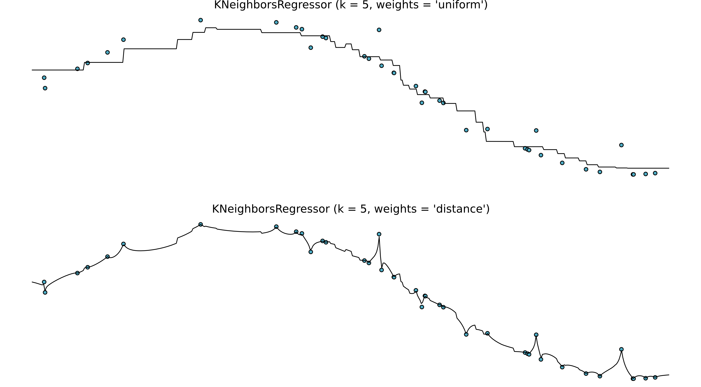

----

Linear models
================================================================================

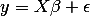

.. raw:: html

    
    
    
    

.. code-block:: python

   from sklearn import linear_model
   clf = linear_model.LinearRegression()
   clf.fit ([[0, 0], [1, 1], [2, 2]], [0, 1, 2])

.. raw:: html

    
    

----

Shrinkage
================================================================================

Let's consider the case where then number of sample is small, and the number
of dimensions is high.

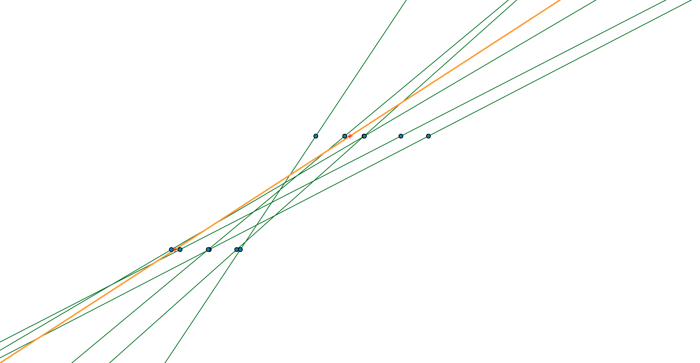

Noise in the observation introduce high variance.

----

Penalized linear models
================================================================================

**Ridge regression**

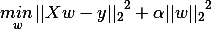

or **Lasso**

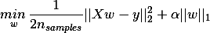

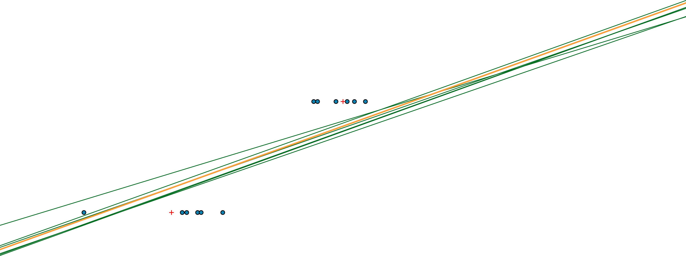

----

Random forests
================================================================================

Decision trees create a model that predicts the value of a target variable by
learning **simple decision rules** inferred from the data features:



----

Random forests
================================================================================

- Build a **forest of trees** :

  - Each tree is build from a **sample drawn with replacement** from the training
    set.
  - Each decision rules is picked as the best split among a **random subset of the
    features**.

- Average the results of all the trees of the forest.

----

Cross validation
================================================================================

How to choose the parameters?

- Select a fraction of your data as a *training set*.
- Learn your model on the training set.
- Test the prediction on the rest of the dataset and measure the error.

----

Some code using sklearn
================================================================================

- Train/predict easily any estimators with scikit-learn.

  .. code-block:: python

    e = Estimator()
    e.fit(X_train, y_train)
    y_predict = e.predict(X_test)

- Cross validate easily with scikit-learn

  .. code-block:: python

     from sklearn import cross_val
     cv = cross_val.StratifiedKFold(X)
     for train, test in cv:
        e.fit(X[train], y[train])
        e.predict(X[test])

----

How to measure the error?
================================================================================

- **regression**: mean square error
- **classification**: count the number of errors
- **ranking**: count the number of pairs for which the ranking between the two
  elements of that par is wrong.

----

A machine learning challenge in 10 steps
================================================================================

----

1: The evaluation method
================================================================================

.. raw:: html

   <blockquote>

"Evaluation of this challenge will be based on the accuracy of the rank order
of the test set cell lines in comparison to ranks of the actual, measured
sensitivities."

.. raw:: html

   </blockquote>
    

.. code-block:: python

   from sklearn import metrics
   scores = cross_validation.cross_val_score(clf, iris.data,
                                             iris.target, cv=5,
                                             score_func=metrics.f1_score)

----

2: Building features
================================================================================

- The data never comes in the correct format (images, sound signal, texts).
- Even if it does, it needs preprocessing (bias, missing values, etc).

.. raw:: html

   <blockquote>

**At first, build the feature as simply as possible.**

.. raw:: html

   </blockquote>

.. code-block:: python

   from sklearn.feature_extraction.text import CountVectorizer
   vectorizer = CountVectorizer(min_df=1)
   corpus = ['This is the first document.',
             'This is the second second document.',
              'And the third one.',
              'Is this the first document?']
   X = vectorizer.fit_transform(corpus)

----

3: Create a baseline
================================================================================

.. raw:: html

   <blockquote>

**Choose the simplest algorithm possible, and compute the validation score on
it.**

You now have a baseline to compare your new algorithms to.

.. raw:: html

   </blockquote>

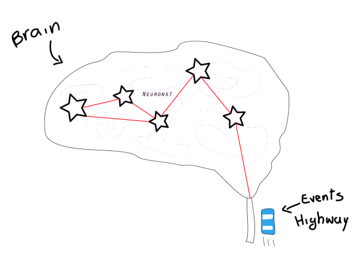

----

4: Make sure you can run all the steps easily over and over again.
--------------------------------------------------------------------------------

.. raw:: html

   <blockquote>

What you do, you will have to do over and over again.

.. raw:: html

   </blockquote>

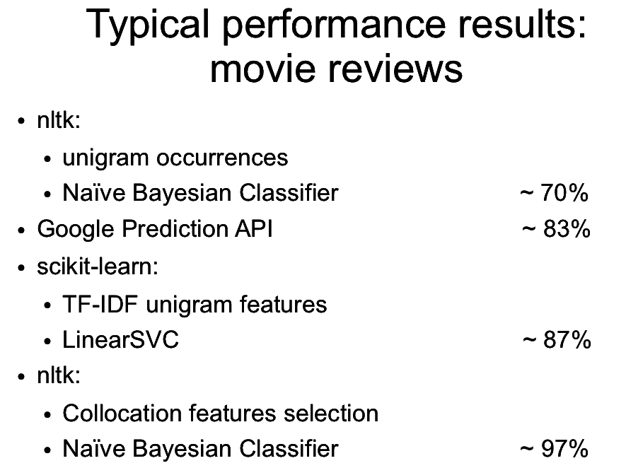

----

5: Test all the classifiers (that match your problem) from sklearn
================================================================================

- Use a grid search to set the parameters.
- Evaluate the performance using cross validation.
- Build a performance results board

-----

6: Keep track of everything you do
================================================================================

.. image:: images/data_management.gif

----

7: Start reading... 
================================================================================

.. raw:: html
   
    
    
    

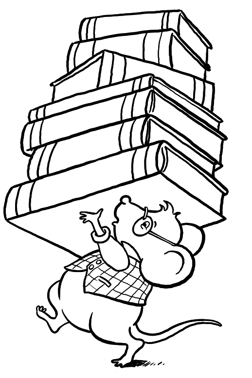

-----

8. Don't neglect building good features
================================================================================

.. image:: images/gene_network.png
   :scale: 50%

-----

9: It's never over...
================================================================================

.. raw:: html

  <blockquote>

It's nto because the challenge is finished that it is over.
.. raw:: html

  </blockquote>

- Look at what the winners did.

----

Thank you for your attention
================================================================================

- http://scikit-learn.org/stable/
- https://github.com/scikit-learn

