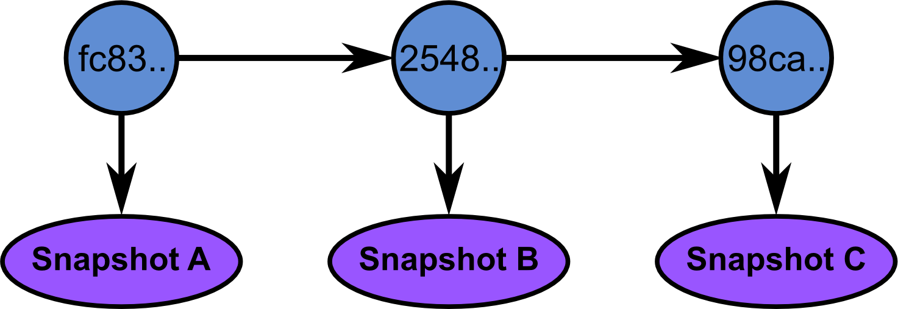
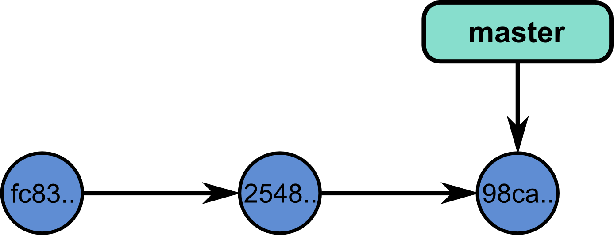
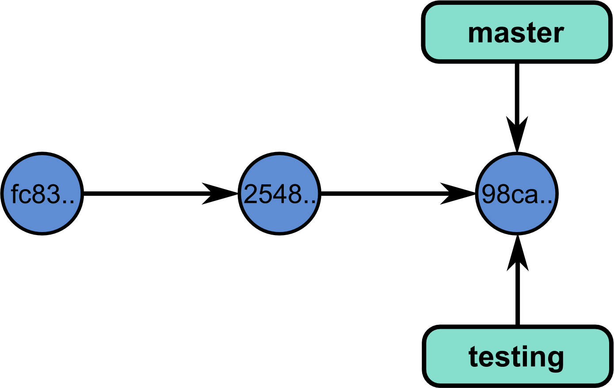
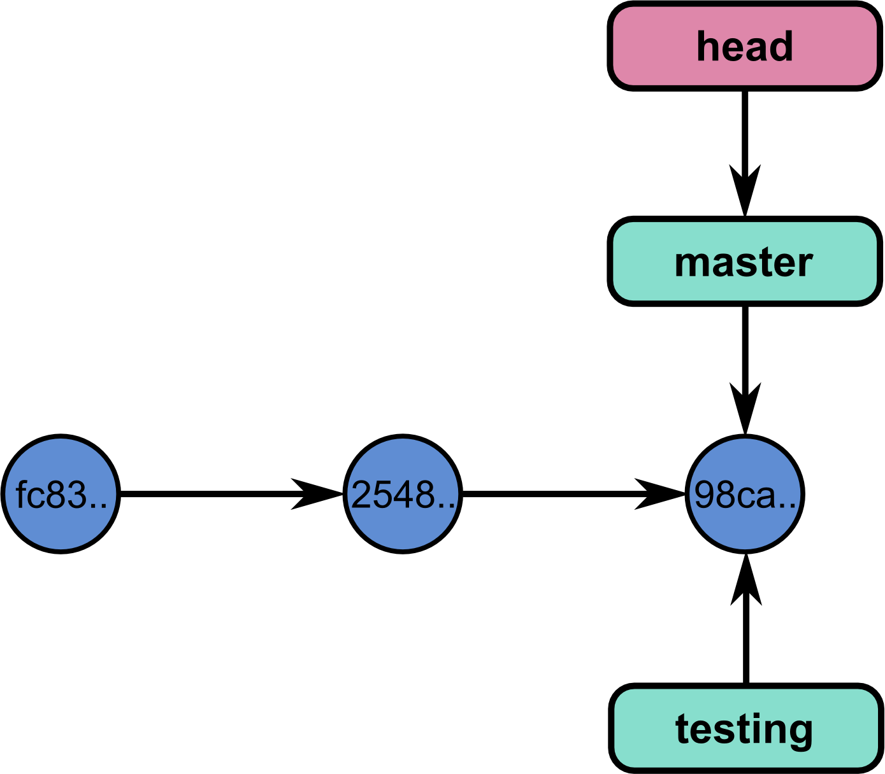

================================================================================
Git and Github
================================================================================

-------

Why do I need version control ?
================================================================================

As researchers, you want:

- reproducible research
- fast and efficient research

.. image:: images/Journal-of-Irrproducibe-Research.jpg

------

A story told by filenames
================================================================================

.. image:: images/version_control.gif

.. raw:: html

   

"Piled Higher and Deeper" by Jorge Cham: www.phdcomics.com

.. raw:: html

  

----

The Python community
================================================================================

.. raw:: html

   

+-----------------------------------+----------------------------------------+
| Github                            | Bitbucket                              |
+===================================+========================================+
| - Numpy                           | - PIL                                  |
| - Scipy                           |                                        |
| - IPython                         |                                        |
| - matplotlib                      |                                        |
| - Sympy                           |                                        |
| - Scikit-learn                    |                                        |
| - Scikit-image                    |                                        |
| - Numba                           |                                        |
| - Mayavi                          |                                        |
| - Traits                          |                                        |
| - Enable                          |                                        |
| - Enamel                          |                                        |
| - Pandas                          |                                        |
| - biopython                       |                                        |
| - Cython                          |                                        |
| - statsmodel                      |                                        |
| ..                                |                                        |
+-----------------------------------+----------------------------------------+

.. raw:: html

   

----

Version control
================================================================================

Version control system:

- keeps all the historical versions for easy tracking.
- benefits team collaboration.
- improves our efficiency.
- can be used as a data center, which makes build automation possible.

File status
================================================================================

- Tracked files: files that were in the last snapshots. They can be in 3
  different states:

  - unmodified
  - modified
  - staged

- Untracked files: all the other files

-----

File status lifecycle
================================================================================

.. image:: images/git_file_status_lifecycle.png

.. raw:: html

  

Pro Git Boot, by Scott Chacon: http://git-scm.com/book

.. raw:: html

   

----

Branching
================================================================================

----

Commits are repository snapshots.
================================================================================

----

A branch is a pointer to a commit.
================================================================================

----

So we can have many branches !
================================================================================

----

But how to know in which branch we are ?
================================================================================

----

We can switch branches.
================================================================================

.. image:: images/git_4-300dpi.png
   :scale: 25%

----

And commit in a branch.
================================================================================

.. image:: images/git_5-300dpi.png
   :scale: 25%

----

Again...
================================================================================

.. image:: images/git_6-300dpi.png
   :scale: 25%

----

And switch branches
================================================================================

.. image:: images/git_7-300dpi.png
   :scale: 25%

----

The code can diverge.
================================================================================

.. image:: images/git_9-300dpi.png
   :scale: 25%

----

Dealing with conflicts
================================================================================

When a conflict emerges, you must **manually** edit the files::

    <<<<<<< HEAD:calc.py
    print 'the average is', sum(x) / float(len(x))
    print 'sumsqdiffs is', sum(diffs)
    =======
    avg = sum(x) / float(len(x))
    sumsqdiffs = sum(diffs) / float(len(x))

    print 'average is', avg, 'and sumsqdiffs is', sumsqdiffs
    >>>>>>> edgier:calc.py

----

Setting up git on a server
================================================================================

In 3 commands:

  - ``git clone --bare --shared my_project my_project.git``
  - ``scp -r my_project.git user@git.example.com:/opt/git``
  - ``git clone user@git.example.com:/opt/git/my_project``

----

Thank you for your attention
================================================================================

