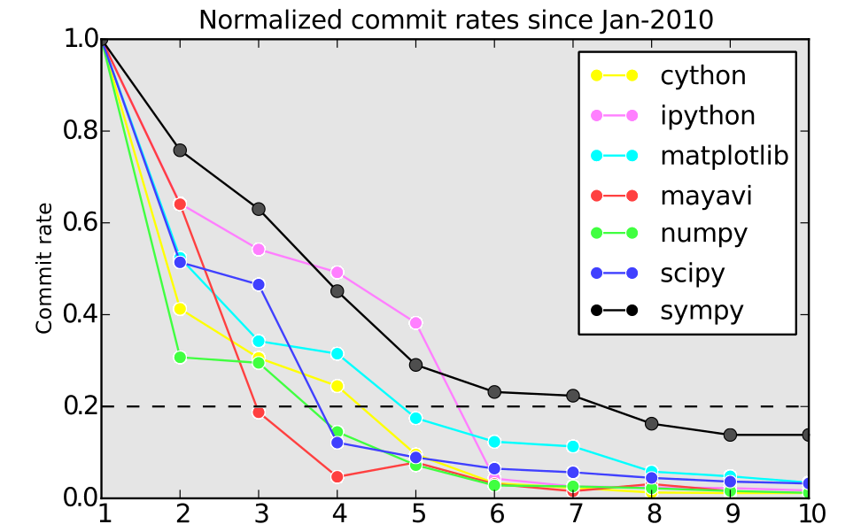
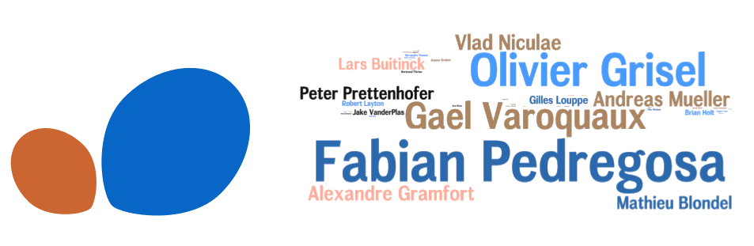
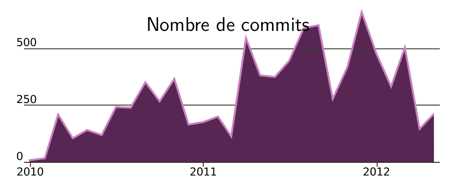
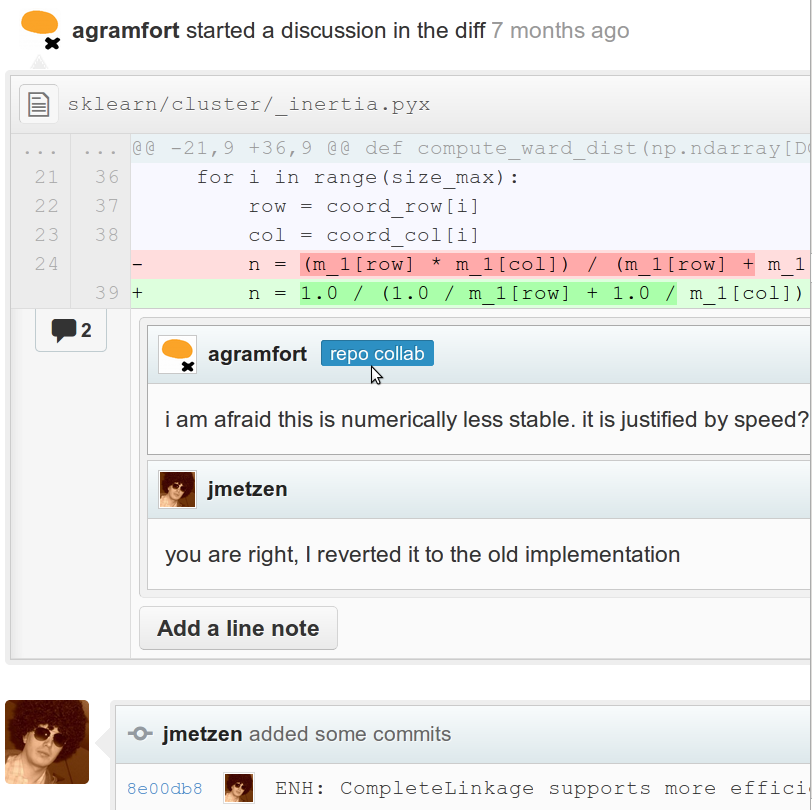
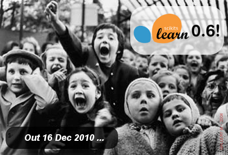
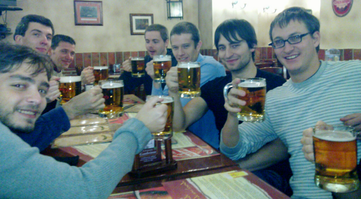
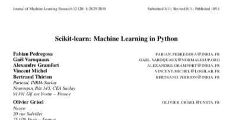

================================================================================
Community based development
================================================================================

------

A typical opensource "success"
================================================================================

**Project: 3D visualisation with Python**

- **2007**: included in Debian
- **2008**: 0.1% of users installed it
- **2012**: 0.5% of the users installed it (scilab = 1.2% of the users)

----

A typical opensource "success"
================================================================================

.. image:: images/my_first_project.png
   :scale: 90%

-----

The OpenSource tragedy (part I)
================================================================================

.. raw:: html

   <blockquote>

"Hey XXX,

I take it you’re too busy. That’s okay, I spent a day trying to install XXX
and I think I'll succeed myself. Next time though please don't ignore my
emails, I really don't like it. You can say 'sorry, I have no time to help
you'. Just don't ignore me"

.. raw:: html

   </blockquote>

----

The open source tragedy (Part II)
================================================================================

----

**Our** big opensource success
--------------------------------------------------------------------------------
Scikit-learn
~~~~~~~~~~~~~~~~~~~~~~~~~~~~~~~~~~~~~~~~~~~~~~~~~~~~~~~~~~~~~~~~~~~~~~~~~~~~~~~~

.. raw:: html

   
   
   
   
   
   

----

Scikit-learn
--------------------------------------------------------------------------------

- **2006-2009**: created by D. Cournapeau GSoC, and deperished
- **2010**: INRIA took over the project - release 0.1
- **2012, March**: release 0.11, with more than 31 contributors
- **2012, August**: release 0.12 with 48 contributors

-----

Our big opensource success
================================================================================

- 130 emails / week on the mailing list;
- 31000 line of codes of Python (1 / 3 of Django);
- 320 forks and 744 followers on Github;
- 26000 lines of documentation;
- 6000 unique visitors / months on the website;

----

10 hard-learned lessons
================================================================================

.. raw:: html

    
    
    

----

Know your user base
================================================================================

- Small potential users means small projects;
- Don't target a public that cannot become a contributor;
- Know your competitors;

.. raw:: html

   <blockquote align="center">

Know when not to create a project.

.. raw:: html

   </blockquote>

----

Use Github
================================================================================

- Github == New cool tool;
- Allows to conduct all discussions online;
- The fork/pull request systems puts everyone on the same foot;
- Allows to (gently) critisize all pull requests efficiently;

----

Don't appropriate to yourself the project identity
================================================================================

- Don't put your name too much in evidence;
- Don't put your employers name too much in evidence (and beware on the use of
  private forges);
- Push other people to communicate in the name of the project;

----

Aim quality
================================================================================

The goal is to add value to your personal code:

- documentation, examples;
- efficiency, generality of the code;
- tests: code base easily modifiable by anyone;
- Code style convention (pep8 for Python);

.. raw:: html

   <blockquote align="center">

The broken window theory:

.. raw:: html

   </blockquote>

.. raw:: html

   <blockquote align="right">

Good code brings good code;

.. raw:: html

   <blockquote>

----

Release often
================================================================================

- Contributors give their code so that users can use it;
- Adrenaline effect when releasing;
- Creates buzz;

----

Control technicity
================================================================================

- Choose carefully the skills needed to contribute to the project: the
  intersection of people knowlegeable both in C++ and convex optimization is
  fairly small;
- Balance between complexity and functionnality gain;
- Delimitate the project goals;

----

Maintain good project culture
================================================================================

- Be positive;
- Be pragmatic and impartial when taking a decision. Choosing a solution you
  do not agree with can be beneficial from a social point of view;
- Develop the community:

  - Delegate responsibilities (release manager);
  - Give commit rights quickly;

----

Organize sprints
================================================================================

.. image:: images/code-frequency.png
   :scale: 90%

(we are looking for sponsors for our next sprints !)

----

Invest in recruiting
================================================================================

- Invest time into potential contributors;
- Help motivated contributors;
- Interns / GSoC can be very beneficial (if well **managed**);

.. FIXME managed => encadré

----

Communicate
================================================================================

- Blog, twitter
- Conference and article, but be inclusive !

----

Conclusion
================================================================================

.. raw:: html

  

- Know your market
- Use Github
- Don't appropriate the project identity
- Target quality
- Release often
- Control technicity
- Maintain good project culture
- Organize sprints
- Invest in recruiting
- Communicate

.. raw:: html

   
