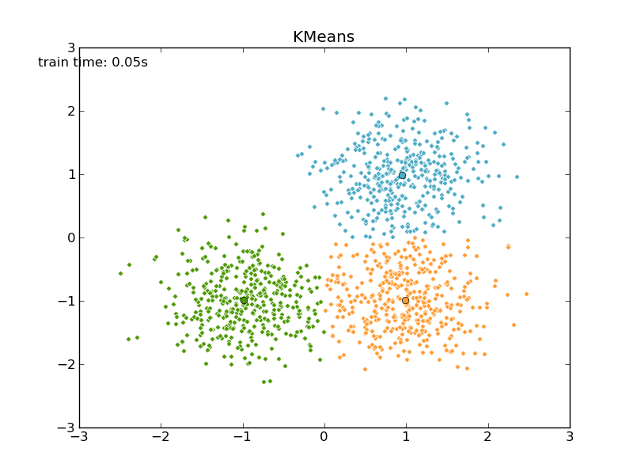
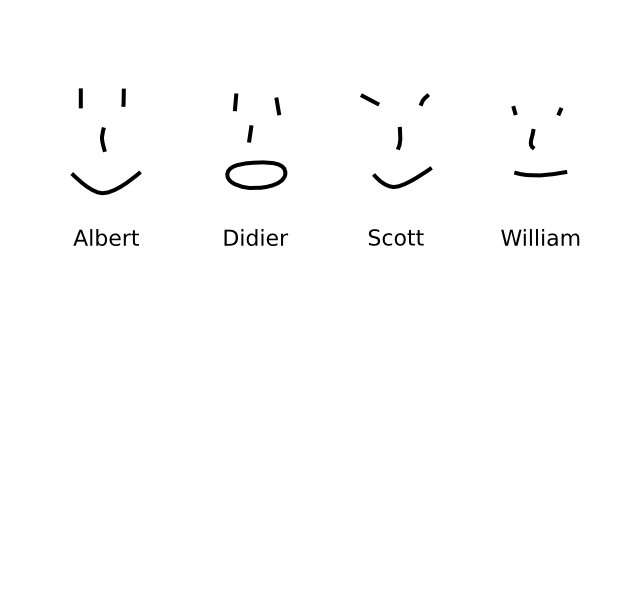
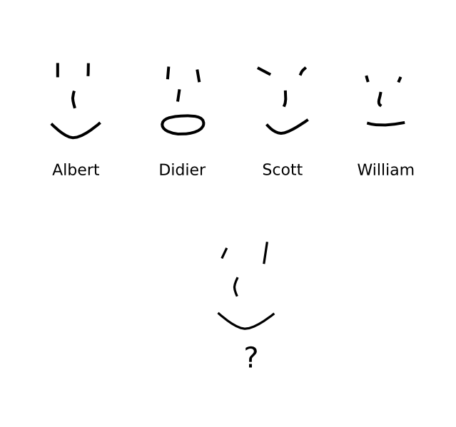
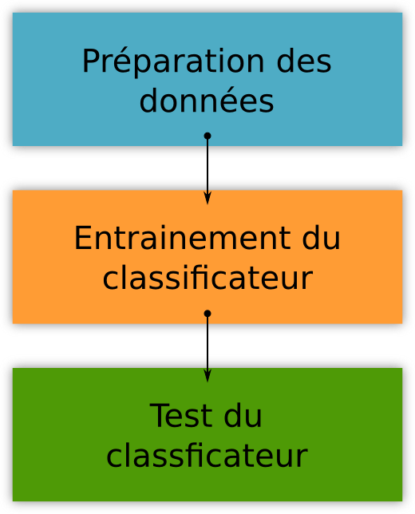
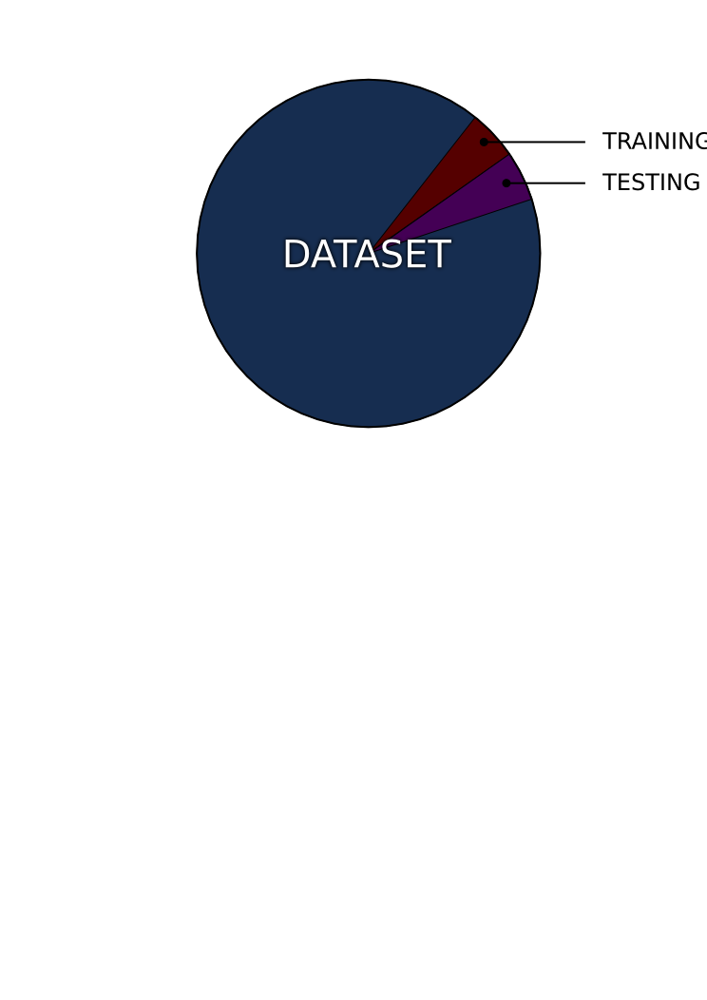
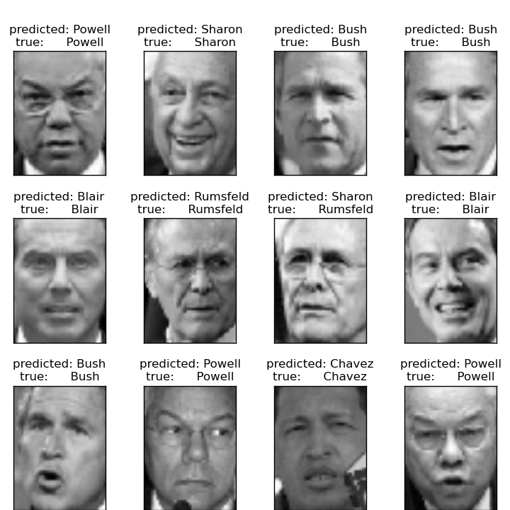

Scikit-Learn: apprendre sans douleur l'apprentissage statistique
================================================================================

----

Plan
--------------------------------------------------------------------------------

.. raw:: html

  

- L'Apprentissage statistique
- Exemple: Reconnaissance Faciale
- Scikit-Learn

.. raw:: html

  
  

.. image:: images/ward.png
  :scale: 75%

.. raw:: html

  

.. Comment reconnaître un spam d'un mail ? Comment prédire la météo ? Comment
.. ranger automatiquement des documents dans différentes catégories ? Comment
.. séparer les différentes sources d'une bande sonore ?
..
.. Il est de plus en plus facile de récolter et de diffuser des données :
.. photographies, images médicales, vidéos partagées par voie de mails, blogs,
.. mms. L'analyse, la compréhension et la prédiction d'un volume grandissant de
.. données prend donc une importance grandissante. Cette nécéssité de fouille de
.. données se traduit par le développement d'algorithmes dit d'*apprentissage
.. statistique*.
..
.. L'apprentissage statistique effraie souvent par la complexité de la théorie
.. mathématique nécessaire à l'implémentation des algorithmes. Le Scikit-Learn
.. est un module d'apprentissage statistique écrit en Python qui s'efforce de
.. rendre ce domaine accessible à tous quelque soit le contexte d'utilisation.
.. Grâce à une documentation très riche, reposant sur des exemples, l'utilisateur
.. peut facilement découvrir les nombreux algorithmes d'apprentissage statistique
.. présents dans scikit-learn ainsi que les domaines d'application :
.. classification automatique de texte, reconnaissance faciale, modélisation de
.. la répartition géographique d'une espèce animalière, etc.
..
.. Une grande variété de problèmes différents nécessitent l'utilisation
.. l'apprentissage statistique. Cependant, il n'y a pas de solution universelle :
.. à chaque type de données il faut associer une stratégie efficace. L'un des
.. buts du scikit-learn est de faciliter la compréhension par l'expérimentation
.. numérique. Non seulement il est facile d'assembler des briques élémentaires du
.. scikit pour parvenir à une solution dédiée, mais en plus la disponibilité du
.. code, en license libre, permet de le "démonter" pour le comprendre. A ce
.. titre, un effort important est accordé à l'utilisation de technologies simples
.. mais efficaces, comme le language Python, et à la lisibilité du code. La
.. documentation, les exemples, et la librairie elle-même pourraient-ils
.. remplacer l'utilisation de livres, plus rébarbatifs, dans l'apprentissage de
.. l'apprentissage pour les non matheux?

----

L'Apprentissage statistique
================================================================================

--------------------------------------------------------------------------------

Statistiques
--------------------------------------------------------------------------------

  "La statistique est à la fois une science formelle, une méthode et une
  technique. Elle comprend la collecte, l'analyse, l'interprétation de données
  ainsi que la présentation de ces ressources afin de les rendre
  compréhensibles de tous."
      -- wikipedia

.. raw:: html

  

.. image:: images/gaussian.png
  :scale: 70%

.. raw:: html

  

--------------------------------------------------------------------------------

Apprentissage statistique
--------------------------------------------------------------------------------

ou apprentissage automatique
~~~~~~~~~~~~~~~~~~~~~~~~~~~~~~~~~~~~~~~~~~~~~~~~~~~~~~~~~~~~~~~~~~~~~~~~~~~~~~~~

  "L'apprentissage automatique (machine learning en anglais), un des champs
  d'étude de l'intelligence artificielle, est la discipline scientifique
  concernée par le développement, l'analyse et l'implémentation de méthodes
  automatisables qui permettent à une machine (au sens large) d'évoluer grâce à
  un processus d'apprentissage, et ainsi de remplir des tâches qu'il est
  difficile ou impossible de remplir par des moyens algorithmiques plus
  classiques."
      -- wikipedia

.. raw:: html

  

.. image:: images/regression_linear.png
  :scale: 85%

.. raw:: html

  

--------------------------------------------------------------------------------

L'Apprentissage supervisé
--------------------------------------------------------------------------------

ou analyse discriminante
~~~~~~~~~~~~~~~~~~~~~~~~~~~~~~~~~~~~~~~~~~~~~~~~~~~~~~~~~~~~~~~~~~~~~~~~~~~~~~~~

- Production automatique de règles à partir d'une base de données contenant
  des cas déjà traité et validés

  - **Classification**
  - **Regression**

.. raw:: html

  

.. image:: images/hyperplane.png
  :scale: 90%

.. raw:: html

  

--------------------------------------------------------------------------------

L'Apprentissage non supervisé
--------------------------------------------------------------------------------

ou classification automatique
~~~~~~~~~~~~~~~~~~~~~~~~~~~~~~~~~~~~~~~~~~~~~~~~~~~~~~~~~~~~~~~~~~~~~~~~~~~~~~~~

- Division d'un groupe de données en sous groupes de données similaires

-------------------------------------------------------------------------------

L'Apprentissage statistique en pratique
--------------------------------------------------------------------------------

.. raw:: html

  
  
We now derive the <em>best linear unbiased prediction</em> of the sample path
   conditioned on the observations:
 
   
  

 
  
It is derived from its <em>given properties</em>:
 
  <ul class="simple"> 
  <li>It is linear (a linear combination of the observations)</li> 
  </ul> 
   
  

 
  <ul class="simple"> 
  <li>It is unbiased</li> 
  </ul> 
   
  

 
  <ul class="simple"> 
  <li>It is the best (in the Mean Squared Error sense)</li> 
  </ul> 
   
  

 
  
So that the optimal weight vector  is solution of the following
  equality constrained optimization problem:
 
   
  

 
  
Rewriting this constrained optimization problem in the form of a Lagrangian and
  looking further for the first order optimality conditions to be satisfied, one
  ends up with a closed form expression for the sought predictor &#8211; see
  references for the complete proof.
 
  
In the end, the BLUP is shown to be a Gaussian random variate with mean:
 
   
  

 
  
and variance:
 
  

.. p 79

--------------------------------------------------------------------------------

Applications
--------------------------------------------------------------------------------

.. raw:: html

  

- Reconnaître un spam d'un mail
- Prédire la météo
- Séparer les sources d'une bande sonore
- Ranger automatiquement des documents dans des catégories

.. raw:: html

  

.. image:: images/ica.png
  :scale: 65%

--------------------------------------------------------------------------------

Exemple: Reconnaissance faciale
================================================================================

--------------------------------------------------------------------------------

L'idée
--------------------------------------------------------------------------------

-----------

L'idée
--------------------------------------------------------------------------------

-----------

Le principe
--------------------------------------------------------------------------------

------

Les données
--------------------------------------------------------------------------------

http://vis-www.cs.umass.edu/lfw/

- Un total de

  - 13233 images
  - 5749 personnes
  - 1680 personnes avec deux ou plus images

.. image:: images/people.png
  :scale: 40%

-----------

Préparation des données
--------------------------------------------------------------------------------

- Normalisation des données

  - Colorisation
  - Taille des images
  - Positionnement des images

.. image:: images/bush.png
  :scale: 75%

--------------------------------------------------------------------------------

Eigenfaces
--------------------------------------------------------------------------------

.. image:: images/PCA_fish.png
  :scale: 75%

-----

Eigenfaces
--------------------------------------------------------------------------------

Un visage peut être composé de:

  ``alpha * eigenface_1 + beta * eigenface_2 + gamma * eigenface_3``

.. image:: images/eigenface.png

--------

Préparation des données
--------------------------------------------------------------------------------

Séparation des données en **Jeu d'apprentissage** et **Jeu de test**

--------------------------------------------------------------------------------

Le classificateur
--------------------------------------------------------------------------------

- ``fit`` : permet au classificateur d'*apprendre* à partir d'un set de
  données
- ``predict`` : permet au classificateur de prédire

.. raw:: html

  <pre class="highlight">

  ################################################################################
  # Train a SVM classification model
  param_grid = {
  &#39;C&#39;: [1, 5, 10, 50, 100], 
  &#39;gamma&#39;: [0.0001, 0.0005, 0.001, 0.005, 0.01, 0.1], 
  } 
  clf = GridSearchCV(SVC(kernel=&#39;rbf&#39;), param_grid, 
                    fit_params={&#39;class_weight&#39;: &#39;auto&#39;}) 
  clf = clf.fit(X_train_pca,
                y_train) 

  ################################################################################ 
  # Quantitative evaluation of the model quality on the test
  set 
  y_pred = clf.predict(X_test_pca) 
    </pre>
  

-----

Les résultats
--------------------------------------------------------------------------------

-----------

Les résultats
--------------------------------------------------------------------------------

.. image:: images/resultat_2.png
  :scale: 75%

-----------

Les résultats
--------------------------------------------------------------------------------

+--------------------+-----------+--------+----------+---------+
|                    | precision | recall | f1-score | support |
+====================+===========+========+==========+=========+
|  Ariel Sharon      | 0.81      | 0.85   |  0.83    |   20    |
+--------------------+-----------+--------+----------+---------+
|  Colin Powell      | 0.76      | 0.80   |  0.78    |   59    |
+--------------------+-----------+--------+----------+---------+
|  Donald Rumsfeld   | 0.64      | 0.83   |  0.72    |   30    |
+--------------------+-----------+--------+----------+---------+
|  George W Bush     | 0.95      | 0.84   |  0.89    |  132    |
+--------------------+-----------+--------+----------+---------+
|  Gerhard Schroeder | 0.77      | 0.86   |  0.81    |   28    |
+--------------------+-----------+--------+----------+---------+
|  Hugo Chavez       | 0.78      | 0.82   |  0.80    |   17    |
+--------------------+-----------+--------+----------+---------+
|  Tony Blair        | 0.88      | 0.83   |  0.86    |   36    |
+--------------------+-----------+--------+----------+---------+

--------

Scikit-Learn
================================================================================

----

Scikit-learn
--------------------------------------------------------------------------------
un module d'apprentissage statistique en python
~~~~~~~~~~~~~~~~~~~~~~~~~~~~~~~~~~~~~~~~~~~~~~~~~~~~~~~~~~~~~~~~~~~~~~~~~~~~~~~~

- **Efficace**

  - Bons algorithmes
  - Numpy + scipy
  - C + Cython + scipy

- **Simple d'utilisation**

  - Pythonesque
  - Simple à installer: pas de dépendances autre que numpy et scipy
  - API uniforme, paramètres par défaut
  - Très bien documenté

--------------------------------------------------------------------------------

Le module
--------------------------------------------------------------------------------

- Cycle de développement de  2-3 mois.
- Plus de  35 contributeurs (25 dans la dernière release)
- Shipped with: Ubuntu, Debian, Macports, NetBSD, Mandriva, Enthought Python
  Distribution. Binaires windows, et easy_install

----

Conclusion
================================================================================

----------

Sources
--------------------------------------------------------------------------------

- Aiguille et Botte de foin *Gaël Varoquaux*
- Wikipedia
- Documentation de Scikit-learn
